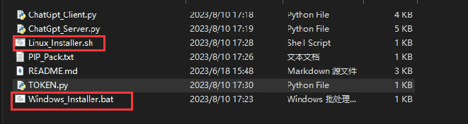
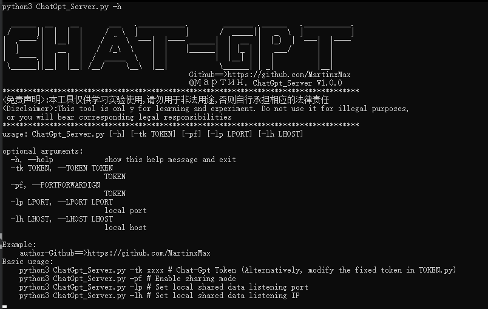
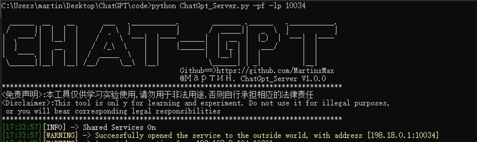
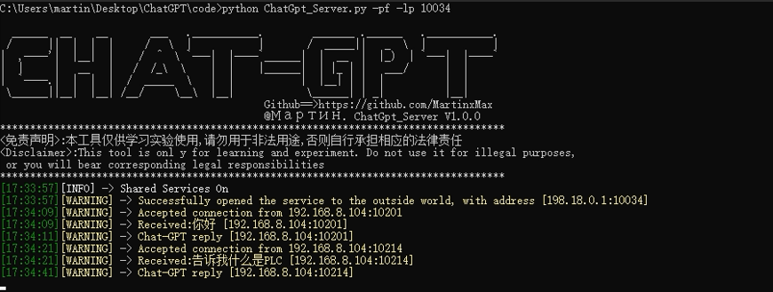
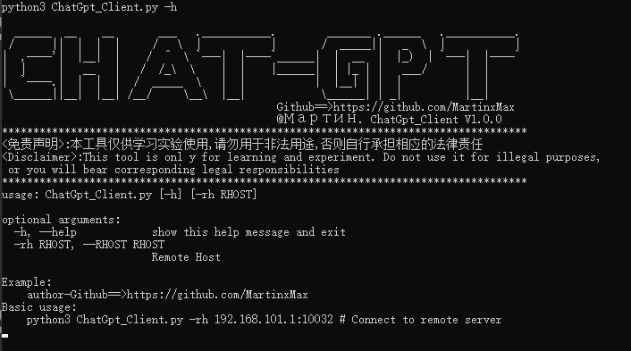
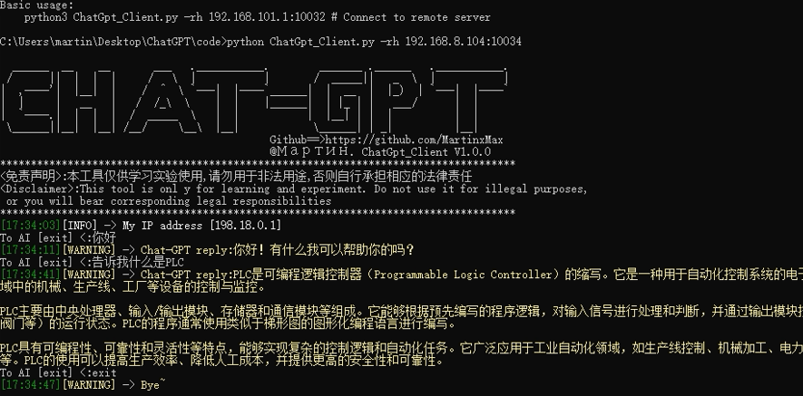

  

 
 
  
 
 

 

  
   
 <table>
  <tr>
      <th>Function</th>
  </tr>
  <tr>
    <th>Calling the chatgpt interface to achieve data sharing between internal and external networks</th>
</tr>
 
 </table>

!!Please set your agent to TUN mode!!

  
## Chatgpt Example

``Choose your operating system installation``

 

## Server Example

``#python3 ChatGpt_Server.py -h``

 

*Use (-pf) for data sharing and open ports for other hosts to query(If not filled in, it will be for personal use)*

``_You can use - lp to customize the port, default to 10032_``

``#python3 ChatGpt_Server.py -pf -lp 10034``

 

 

## Client Example

``#python3 ChatGpt_Server.py -h``

 

``#python3 ChatGpt_Server.py -rh 192.168.8.104:10034``

 

